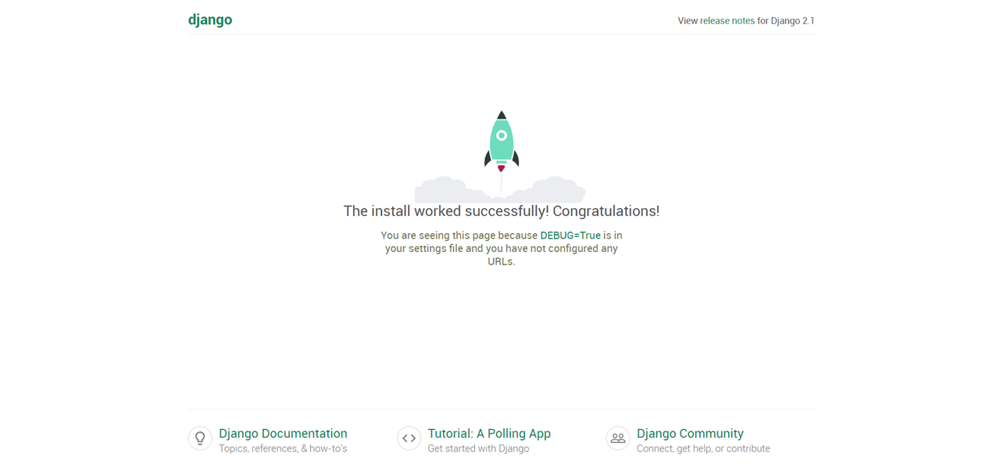

Django Project Start!
===

Contents
---

- [Project 생성](#project-생성)
  - [준비](#준비)
  - [명령어](#명령어)
- [App 생성](#app-생성)
  - [명령어](#명령어)
- [서버 작동](#서버-작동)

Project 생성
---

장고를 이용하여 개발을 진행하기 위해서는 프로젝트를 생성해야만 한다.
> 프로젝트는 장고에서 개발 대상이 되는 프로그램들을 의미한다.

### 준비
프로젝트 생성에 앞서 장고가 설치된 가상환경이 준비되어 있어야 한다. 만약에 준비되어 있지 않다면 해당 [링크](./Install-Django.md)를 참고해서 가상환경을 만들어 주도록 하자.

가상환경이 준비되었다면 아래 명령어로 가상환경을 실행한다.

```bash
$ source "가상환경명"/scripts/activate
$ source "가상환경명"/bin/activate
```
> 윈도우의 경우 첫번째 명령어를, 맥이나 리눅스의 경우 아래 명령어를 사용한다.

```bash
(env) ~/django_workspace/project master $
```

정상적으로 가상환경을 실행했을 시 다음과 같이 쉘 상에 가상환경명이 표기된다.

### 명령어
```bash
$ django-admin startproject "프로젝트명" .
```
프로젝트를 생성하면 필요한 파일이나 디렉터리가 자동적으로 생성된다.

App 생성
---

`App`은 프로젝트의 구성단위로 보통 프로젝트 폴더가 생성된 경로에 동일하게 생성합니다.

### 명령어

```bash
$ python manage.py startapp "App명"
```

서버 작동
---

정상적으로 장고 프로젝트가 생성되었는지 확인하기 위해서는 서버를 작동시켜야 합니다.

```bash
$ python manage.py runserver
```
> MAC OS X와 Linux의 경우 python3 사용

위 명령어를 사용하면, 장고 프로젝트가 로컬에서 실행된다.



> 작동중인 로컬 서버는 로컬주소인 `127.0.0.1:8000`에서 확인할 수 있다.

서버 종료는 `ctrl+c`로 할 수 있다.
