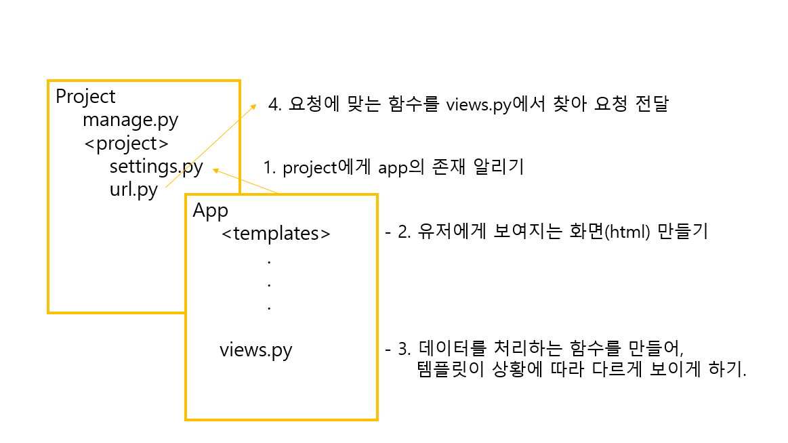

Hello Lion
===

앞서 프로젝트 및 앱 생성 과정을 알아보았으며, 이를 토대로 ```Hello Lion```을 출력하는 페이지를 만들어 보도록 할 것이다. 이 프로젝트는 장고를 시작하는 가장 쉬운 난이도의 프로젝트이기는 하나 장고를 배우는 것이 처음이라면 구조 자체가 복잡하게 느껴질 수 있다. 하지만 해당 프로젝트를 진행하면 장고의 전체적인 구조를 머리 속에 그리는 것이 가능할 것이다. 

전체 구조
---



Hello World를 출력하는 프로젝트를 구현하는 과정은 크게 4단계로 나누어 볼 수 있다.

- [앱 - 프로젝트 연결](#앱-프로젝트-연결)
- ["Hello Lion" 출력하는 html 생성](#hello-lion-출력하는-html-생성)
- [사용자 요청에 html파일을 호출하는 함수 작성](#사용자-요청에-html파일을-호출하는-함수-작성)
- [url과 views( 함수가 작성된 파일 ) 연결](#url과-views-연결)

이러한 방식의 프로젝트 구조는 다른 프로젝트에서도 사용되는 방식이므로 꼭 익혀두어야만 한다.

> 장고 구조에 대해서 좀 더 알아보고 싶다면 [MTV패턴](MTV-Pattern.md) 글을 참고하자


앱 프로젝트 연결
---

프로젝트를 시작하기 위해서는 프로젝트와 앱을 생성해야 한다. 이 작업에 필요한 명령어는 [해당 글](Django-Project-Start.md)에 작성해두었다. 하지만 앱은 생성했다고 해서 프로젝트에서 바로 사용할 수는 없고, 번거롭기는 하지만 앱을 프로젝트에 등록해야 한다.

### 앱 등록

[settings.py](https://github.com/likelionmju/likelionmyongji_hellolion/blob/master/firstproject/settings.py)
```python
INSTALLED_APPS = [
    'django.contrib.admin',
    'django.contrib.auth',
    'django.contrib.contenttypes',
    'django.contrib.sessions',
    'django.contrib.messages',
    'django.contrib.staticfiles',
    'hellolion',
]
```

앱을 등록하는 과정은 간단하다. 단지 프로젝트 디렉토리 안에 있는 ```settings.py```라는 파일에서 ```INSTALLED_APPS```라는 부분에 앱명을 작성해서 추가해주면 된다.

> 주의!! 리스트 요소 마지막에는 콤마(,)를 붙이도록 한다. 안그러면 에러가 발생할 것이다..

Hello Lion 출력하는 html 생성
---

장고에서 템플릿(Templates)은 사용자에게 보여지는 화면을 담당하는 부분이다. 보통 템플릿은 html을 말하며 이러한 포맷의 파일을 [templates](https://github.com/likelionmju/likelionmyongji_hellolion/tree/master/hellolion/templates)라는 디렉토리에 생성하면 우리가 보여주고 싶은 화면을 사용자에게 띄울 수 있다.

> templates라는 폴더는 자동으로 생성되지 않으며, 앱 폴더 내부에 직접 생성하면 된다. 

[home.html](https://github.com/likelionmju/likelionmyongji_hellolion/blob/master/hellolion/templates/home.html)

```html
<!DOCTYPE html>
<html lang="en">
<head>
  <meta charset="UTF-8">
  <title>Hello Lion!</title>
</head>
<body>
    <h1>Hello Lion</h1>
</body>
</html>
```

사용자 요청에 html파일을 호출하는 함수 작성
---

뷰(View)는 데이터를 처리하는 함수들을 정의하는 부분이다. 여기서 템플릿(Template)이 사용자에게 어떻게 보여지게 할 지를 결정할 수 있다. 이번 프로젝트에서는 사용자 요청이 오면 html 파일을 특별한 가공없이 보여주기만 하는 함수를 작성해볼 것이다.

[views.py](https://github.com/likelionmju/likelionmyongji_hellolion/blob/master/hellolion/views.py)

```python
from django.shortcuts import render

# Create your views here.
def home(request):
    return render(request, 'home.html')

```

home이라는 함수는 요청이 오면 ```home.html```을 render라는 메서드를 통해서 반환시킨다. 

이는 사용자가 home이라는 함수를 호출하는 것으로 home.html을 볼 수 있다는 것과 같은 말이다.

url과 views 연결
---

이쯤되면 사용자가 어떻게 함수를 호출할 수 있는지 궁금해질 것이다. 그 해답은 바로 **url**이다!! 

장고는 특정 url에 접속하면 특정 함수가 호출되도록 설정할 수 있으며 [urls.py](https://github.com/likelionmju/likelionmyongji_hellolion/blob/master/firstproject/urls.py) 파일에서 해당 설정이 이루어진다.

```python
from django.contrib import admin
from django.urls import path
import hellolion.views

urlpatterns = [
    path('admin/', admin.site.urls),
    path('', hellolion.views.home, name='home'),
]
```

위 코드에서 ```urlpatterns```는 특정 url에서 어떤 함수를 사용할 것인지를 지정하는 부분이다. home이라는 함수가 최상위 주소('')에서 호출되도록 하기 위해서 ```path('', hellolion.views.home, name='home'),```라고 작성해주었다.

> 주의!! urlpatterns에 요소를 추가할 떄도 마지막에 콜론(,)을 붙여주어야 한다.

### path 
위 코드에서 ```urlpatterns```에 특정 url을 지정하기 위해서 path라는 것이 사용되었다. 좀 더 자세히 알아보자.

    path('url', 'app명.views.함수명', name='path명')

path는 세 인자(url, 함수, 이름)를 받는다. 이를 통해서 url과 함수를 맵핑할 수 있으며, 세 번째 인자로 해당 url에 대한 이름을 지정하여 이후 장고 내에서 url 경로를 호출할 수 있다.

> 세 번째 인자는 필수 속성은 아니다. 나중에 url을 간편하게 호출하기 위해서 사용한다.


# 결과

```bash
$ python manage.py runserver
```


서버를 작동하면, 로컬 호스트(http://127.0.0.1:8000/)에서 ```Hello Lion```이라는 문자를 브라우저에서 확인 할 수 있다!
