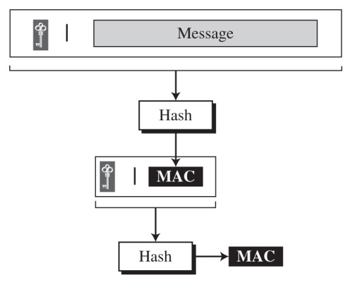

메시지 인증 코드(MAC)
===

해시함수는 데이터의 `무결성`을 보장하지만 발신자의 신원 확인이 불가능하다. 이러한 문제를 해결하기 위해 `인증 절차`를 추가한 것이 `메시지 인증 코드(MAC)`이다.

Contents
---

- [개념](#개념)
  - [변경 감지 코드(MDC)](#변경-감지-코드mdc)
    - [인증 과정](#인증-과정)
    - [문제점](#문제점)
  - [메시지 인증 코드(MAC)](#메시지-인증-코드mac)
    - [인증 과정](#인증-과정1)
    - [문제점](#문제점1)
- [종류](#종류)
  - [Nested MAC](#nested-mac)
  - [HMAC](#hmac)
    - [생성 과정](#생성-과정)
  - [CMAC](#cmac)
    - [생성 과정](#생성-과정1)
    - [k 생성 알고리즘](#k-생성-알고리즘)
- [활용 사례](#활용-사례)
  - [IPsec](#ipsec)
  - [SSL/TLS](#ssltls)
- [공격](#공격)
  - [재전송 공격](#재전송-공격)
    - [보안 대책](#보안-대책)
  - [키 추측에 의한 공격](#키-추측에-의한-공격)
    - [보안 대책](#보안-대책1)
- [해결할 수 없는 문제](#해결할-수-없는-문제)
  - [제 3자에 대한 증명](#제-3자에-대한-증명)
  - [부인 방지](#부인-방지)

개념
---

### 변경 감지 코드(MDC)

변경 감지 코드(MDC, Modification Detection Code)는 메시지의 `무결성을 보장`하는 다이제스트이다.

#### 인증 과정

- Alice는 안전하지 않은 채널로 `메시지 M`을 Bob에게 전송
- `Hash(M)`으로 도출한 해시값 `MDC`를 안전한 채널로 전송
- Bob은 수신한 메시지를 해시 알고리즘을 통해 해시값 `MDC'` 도출
- Bob은 안전한 채널로 수신한 해시값 `MDC`과 계산한 해시값 `MDC'`를 비교
- 동일하다면 전달받은 메시지의 무결성이 입증됨

#### 문제점

- `안전한 채널`이 보장됨이 전제임
- 만약 해당 채널이 탈취된다면 메시지와 MDC 모두 위조될 수 있음

### 메시지 인증 코드(MAC)

송ㆍ수신자 간 `비밀키`를 공유하는 것으로 안전한 채널이 확보되지 않아도 `무결성`과 전송자의 `신원 인증`을 가능하게 하는 방법

#### 인증 과정

- 원본 `메시지 M`을 `비밀키 K`와 병합하여 해시 수행
- 여기서 만들어진 `MAC`과 `메시지 M`을 안전하지 않은 채널로 전송
- Bob은 수신한 메시지 M과 비밀키 K로` MAC'`을 생성
- 수신한 `MAC`과 자신이 생성한 `MAC'`을 비교
- 동일하다면 전달받은 메시지의 `무결성이 입증`됨과 동시에 `출원지가 Alice`라 판단

#### 문제점

- 송ㆍ수신자 간 비밀키를 공유해야 함
- 따라서 `키 배송 문제`가 발생

종류
---

### Nested MAC 

MAC의 안전성을 높이기 위해 고안된 방법

- 동일한 해시함수로 두 단계 해시 과정을 거침
- 따라서 `두 개의 키`가 존재

### HMAC

NIST는 Nested MAC에 관한 표준인 FIPS 198을 제정

- `Nested MAC`에 패딩 요소 추가
- SHA1과 같은 `일방향 해시함수` 사용

#### 생성 과정

- 메시지를 길이가 `b비트`인 `N개`의 블록으로 분리
- 비밀키 왼쪽에 `0`으로 된 열을 추가하여 `b비트`로 길이를 맞춤
  - 이때 패딩 이전의 비밀키 길이는 N비트 이상을 권장
- 이렇게 생성된 비밀키를 `ipad(Input pad)` 상수와 `XOR` 연산
- 결과값을 N블록들 앞에 위치시켜 `N+1개의 블록`으로 만듦
- 블록을 해시함수에 대입하여 얻은 결과를 `HMAC`이라 한다
- `n비트의 HMAC` 왼쪽에 0을 패딩하여 `b비트`로 만듦
- ipad와는 다른 `상수 opad`와 `b비트`로 패딩한 비밀키를 `XOR` 연산
- `연산 결과값`과 `b비트의 HMAC`을 병합하여 해시 연산
- 최종적으로 `n비트의 HMAC`을 생성

### CMAC

NIST표준 FIPS 113에 정의된 MAC으로써 대칭키 암호시스템의 `CBC모드`를 활용하는 방법

- `암호 블록체인 방식`과 동일한 알고리즘
- 이전 블록의 암호문과 입력값를 XOR 연산하는 방식

#### 생성 과정

- `메시지 M`을 `m비트`의 블록 `N개`로 나눔
  - 마지막 블록이 m비트가 아닐 시 `첫 비트는 1`, `이후 비트는 0`으로 패딩
- `비밀키 K`를 사용하여 `첫 블록 M1`을 암호화하여 `M2`와 `XOR`연산
- 해당 과정을 반복하여 수행
- `마지막 블록`, `직전 암호문`, `새로운 키 k`를 XOR 연산
- 해당 결과값의 `왼쪽부터 n비트`를 CMAC 값으로 활용

#### k 생성 알고리즘

- `0`으로 이루어진 `m비트`의 블록을 `비밀키 K`로 암호화
  - 패딩이 적용되지 않았을 경우 `x`를 곱함
  - 패딩이 적용된 경우 `x^2`를 곱함

활용 사례
---

### IPsec

- `IP(Internet Protocol)`에 보안 기능을 추가한 것
- 통신 내용의 인증과 무결성 확인을 위해 사용

### SSL/TLS

- 웹 통신 프로토콜
- 통신 내용의 인증과 무결성 확인을 위해 사용

공격
---

### 재전송 공격

도청한 `메시지와 MAC 값`을 반복 송신하여 비정상적인 서비스 요청

#### 보안 대책

- 순서 번호
  - `순서번호`가 포함된 MAC을 계산하지 못하도록 하여 방지
- 타임스탬프
  - MAC값이 바르더라도 `시간`이 맞지않다면 오류라고 판단하여 방지
- 비표(nonce)
  - 일회용 `랜덤값`을 포함하여 MAC값을 계산하게 하여 재전송 공격을 방지

### 키 추측에 의한 공격

공격자에 의해 송수신에 사용하는 키를 추측당해서는 안된다.

#### 보안 대책

메시지 인증 코드에 사용되는 키를 생성할 때는 암호학적으로 `안전한 의사 난수 생성기`를 사용해야 한다.

해결할 수 없는 문제
---

### 제 3자에 대한 증명

- `공유키`를 이용하므로 `MAC값`을 계산할 수 있는 것은 `송ㆍ수신자`뿐임
- 하지만 누가 MAC값을 계산했는지는 특정 불가
- 제 3자에게 MAC 값을 계산한 것이 누구인지 증명 불가
- `전자서명`을 사용하면 제 3자에 대한 증명 가능

### 부인 방지

- 송신자 Elice는 Bob에게 `메시지를 보내지 않았다`고 주장
- 해당 주장이 맞는 지 `확인이 불가`하므로 부인방지 불가
- `전자서명`을 이용하면 부인방지 가능
