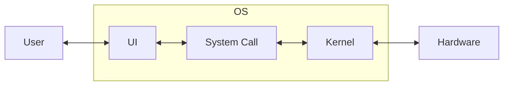

`운영체제(OS)`는 컴퓨터 `사용자(User)`와 컴퓨터 `하드웨어(HW, Hardware)` 간의 인터페이스이다. 운영체제는 하드웨어 및 소프트웨어 `리소스를 관리`한다. 파일 관리, 메모리 관리, 프로세스 관리, 입출력 처리, 디스크 드라이브 및 프린터와 같은 주변 장치 제어와 같은 모든 기본 작업을 수행한다.

구성요소
---

운영체제는 `유저 인터페이스(UI)`, `시스템 콜`, `커널`로 구성된다.

### 유저 인터페이스(UI, User Interface)

사용자는 `명령줄 인터페이스(CLI)` 또는 `그래픽 사용자 인터페이스(GUI)`와 같은 유저 인터페이스를 통해 운영 체제와 직접 상호 작용한다. 운영체제에게 명령을 내리고 작업을 수행하는 것이 목적이다.

대표적인 CLI로는 `Linux`의 `bash Shell`이 있으며, GUI로는 `Windows`나 `macOS`의 데스크톱 환경이 있다. Linux의 경우 기본적으로 GUI를 제공하지 않으며 `GNOME`과 같은 데스크톱 환경을 설치해야 한다.

> 데스크톱 환경이란 운영체제의 기능을 사용자가 쉽게 사용할 수 있도록 그래픽으로 구성한 환경이다. Windows나 macOS에서 사용하는 그래픽 환경을 생각하면 된다.

> 유저 인터페이스는 쉘(Shell)이라고도 부르지만, 대개 CLI 환경에 대해서 말할 때 사용한다. 

### 시스템 콜(System Call)

운영 체제의 커널이 제공하는 서비스를 사용할 수 있도록 하는 인터페이스이다. 일반적으로 유저 인터페이스 또는 응용프로그램이 커널의 기능을 활용해야 하는 경우 호출하여 사용한다.

### 커널(Kernel)

커널은 운영체제의 핵심 컴포넌트로 운영체제의 기본적인 서비스를 제공한다. 여기에는 일반적으로 메모리 관리, 파일 시스템, 프로세스 관리, I/O 장치 관리 및 네트워크 관리 등의 기능이 포함된다.

> 리눅스(Linux)는 사실 정확하게는 운영체제가 아닌 커널이다. `우분투(Ubuntu)`와 같은 운영체제는 리눅스에 UI나 시스템 콜을 더해서 만들어지며, 이를 `리눅스 배포판(Linux Distribution)`이라 한다.
