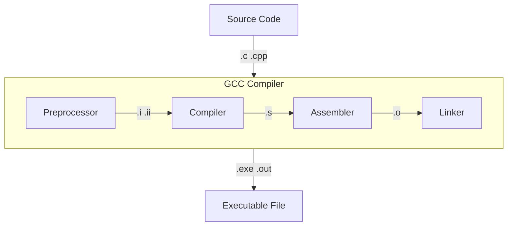

`GCC(GNU Compiler Collection, GNU 컴파일러 모음)`은 GNU 프로젝트로 관리되고 있는 컴파일러이다. C언어만을 대상으로 하던 당시에는 `GNU C Compiler`의 약어였으나, C++과 여타 다른 언어를 지원하면서 현재의 의미로 변경되었다.

컴파일 과정
---



`GCC`는 여러 도구를 모아둔 일종의 `툴 체인`이다. 전처리기, 컴파일러, 어셈블러 그리고 링커를 거쳐 `실행 가능한 파일`을 생성할 수 있도록 돕는다. 이러한 과정은 [[프로그램 실행 과정]]의 컴파일 타임과 로드 타임에 해당된다.

```bash
gcc main.exe main.c
```

GCC를 사용하여 `main.c`라는 소스코드를 `main.exe`라는 실행파일로 컴파일하는 명령어는 다음과 같다. 

구성요소
---

### 전처리기(Preprocessor)

전처리기는 다음과 같은 과정을 거쳐 소스코드에 `헤더 파일을 삽입`하거나 `매크로를 확장`한다. 

- `#`이 붙은 문장 처리
	- 헤더 파일 삽입(`#include`)
	- 매크로 정의(`#define`)
	- 조건부 지시문(`#ifdef`)
- 필요 없는 주석 제거

#### 명령어

```bash
gcc -E main.i main.c
```

main.c라는 `소스코드`를 main.i라는 `전처리가 완료된 코드`로 번역

### 컴파일러(Compiler)

`고급 프로그래밍 언어`로 작성된 소스코드를 `어셈블리어`로 번역한다.

#### 명령어

```bash
gcc -S main.s main.i
```

main.i라는 `전처리가 완료된 코드`를 main.s라는 `어셈블리 코드`로 번역

### 어셈블러(Assembler)

`어셈블리어`를 기계가 해석할 수 있는 `오브젝트 파일`로 번역한다.

#### 명령어
```bash
gcc -c main.o main.s
```

main.s라는 `어셈블리어`를 main.o라는 `오브젝트 파일`로 번역

### 링커(Linker)

여러 `오브젝트 파일`과 `정적 라이브러리`를 연동하여 하나의 `실행파일`로 만든다.

#### 명령어

```bash 
gcc -o main.exe main.o
```

main.o라는 `오브젝트 파일`을 main.exe라는 `실행 파일`로 링크
