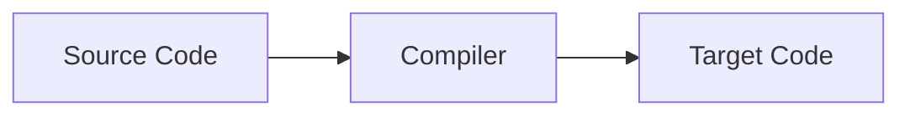

`컴파일러(Compiler)`는 `특정 프로그래밍 언어`로 작성된 소스코드를 `다른 프로그래밍 언어`로 번역하는 프로그램이다. 일반적으로 `고수준의 언어(high-level language)`로 작성된 코드를 `저수준의 언어(low-level language)`로 번역하는데 사용된다. 컴퓨터는 기계어만을 해석할 수 있기 때문에 고급 프로그래밍 언어로 작성된소스코드를 실행하기 위해서는 기계어로 번역하는 과정이 반드시 필요하다.

컴파일러의 입력값을 `소스 코드(Source Code)`라 하며, 컴파일러의 출력값 `목적 코드(Target Code)`라 한다.

참고문헌
---

- [위키피디아 - 컴파일러](https://ko.wikipedia.org/wiki/컴파일러)