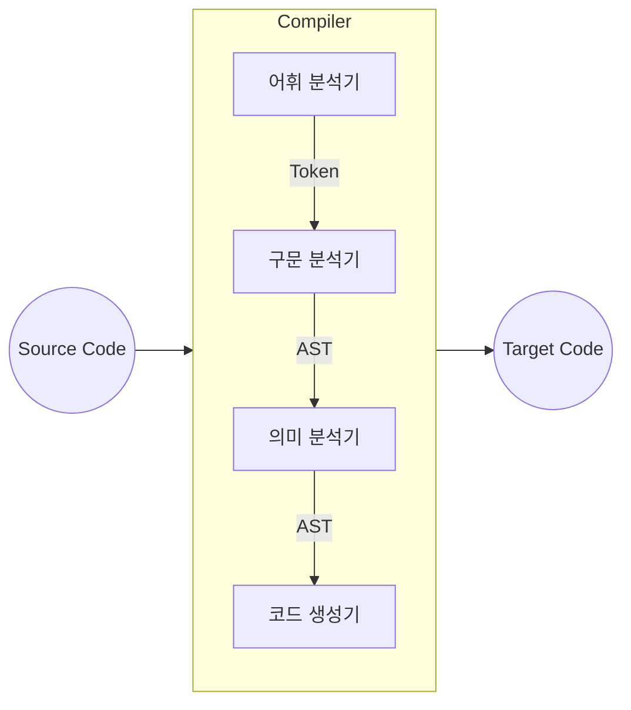

---
tags:
  - cs
  - compiler
---

[[컴파일러|컴파일러]]는 `어휘 분석`, `구문 분석`, `의미 분석` 그리고 `코드 생성` 단계로 구분된다. 컴파일러 설계에 따라 `중간 코드 생성` 단계가 추가되거나 `최적화` 단계가 추가되기도 한다.

어휘 분석(Lexical Analysis)
---

`소스 코드(Source Code)`를 읽어들여, `토큰(Token)`이라는 의미있는 문법 단위로 분리하는 단계이다. 이때 생성된 토큰은 `심볼 테이블(Symbol Table)`에 저장된다.

- 입력
  - 소스 코드(Source Code)
- 출력
  - 토큰(Token)

구문 분석(Syntax Analysis)
---

`구분 분석` 또는 `파싱(Parsing)`이라 부르는 해당 단계에서는 소스 코드가 정의된 `구문 규칙을 따르는지` 검사한다. 심볼 테이블에 있는 토큰을 이용하여 `추상 구문 트리(Abstract Syntax Tree, AST)` 또는 `구문 트리(Parse Tree)`를 생성한다.

- 입력
	- 토큰(token)
- 출력
	- 추상 구문 트리(Abstract Syntax Tree, AST)

의미 분석(Semantic Analysis)
---

구문 트리와 심볼 테이블에 있는 정보를 이용하여 소스 코드가 `의미적으로 올바른지`를 검사한다. 변수, 함수 및 클래스의 정의와 참조가 올바른지 확인하고, 이때 오류가 있으면 오류 메시지를 출력한다. 해당 단계에서 `타입 검사(Type Checking)`도 수행한다.

- 입력
	- 추상 구문 트리(Abstract Syntax Tree, AST)
- 출력
	- 추상 구문 트리(Abstract Syntax Tree, AST)

코드 생성(Code Generation)
---

이전 단계에서 생성된 추상 구문 트리를 이용하여 `목적 코드(Object Code)`를 생성한다. 목적 코드는 보통 `어셈블리어(Assembly Language)` 또는 `기계어(Machine Language)`로 표현된다. 

- 입력
    - 추상 구문 트리(Abstract Syntax Tree, AST)
- 출력
    - 목적 코드(Object Code) 

참고문헌
---

- [CHML - 컴파일러 구조](https://untitledtblog.tistory.com/9)
- [정보통신기술용어해설 - Lexical Analysis, Syntax Analysis, Parsing, Semantic Analysis   어휘 분석, 구문 분석, 의미 분석, 파싱](http://www.ktword.co.kr/test/view/view.php?m_temp1=5787)
- [GeeksForGeeks - Introduction to Syntax Analysis in Compiler Design](https://www.geeksforgeeks.org/introduction-to-syntax-analysis-in-compiler-design/)
