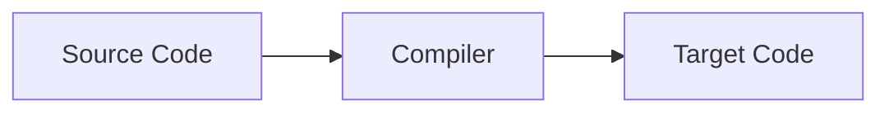
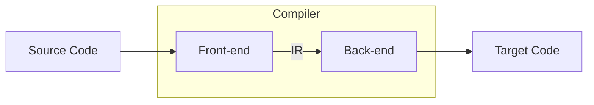
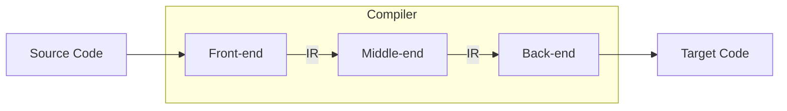

---
tags:
  - cs
  - compiler
---

컴파일러는 설계에 따라 다양한 형태로 구현될 수 있다.

1-Pass Compiler
---

- 가장 단순한 형태의 컴파일러
- 어휘 분석부터 코드 생성까지의 전 과정이 하나의 컴파일러에서 동작

2-Pass Compiler
---

- 전단부(Front-end)와 후단부(Back-end)로 구성
	- 전단부
		- `어휘 분석`, `구문 분석`, `의미 분석` 과정이 이루어짐
	- 후단부
		- `코드 생성` 과정이 이루어짐
- IR(Intermediate Representation, 중간 표현)이 필요함
	- Front-end에서 처리한 결과를 Back-end로 전달하기 위해 사용
	- IC(Intermediate Code, 중간 코드)라고도 부른다
- 실제 목적 코드는 Back-end의 실행 결과 출력됨

3-Pass Compiler
---

- 2-Pass Compiler에서 중단부(Middel-end)를 추가한 구성
	- 중단부
		- 일반적으로 `코드 최적화` 처리
- 2-Pass Compiler와 마찬가지로 IR을 사용하여 다음 처리기에게 전달
- 결과적으로 Back-end의 출력이 목적 코드가 됨