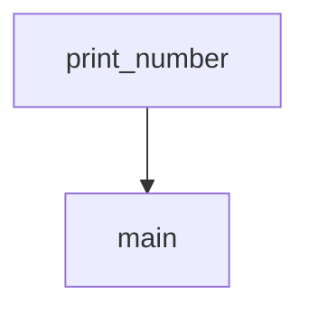

함수 호출 시 생성되며 함수의 `지역변수`, `파라미터`와 `리턴 주소` 등을 담고 있다. 스택에 저장되므로 `스택 프레임(Stack Frame)`이라고도 한다. 함수가 종료되면 스택에서 제거된다.

## 구성 요소


### Return Value

- `호출자(Caller)`에게 값을 반환하기 위해 사용

### Actual Parameters

- 호출된 함수에게 전달하는 매개변수

### Control Link

- `호출자의 활성 레코드`를 참조
- Dynamic하게 동작하는 프로그램은 Control Link들의 체인으로 추적됨
- 그래서 이를 `Dynamic Link`라고도 함

```C
#include<stdio.h>

int num = 10;

void print_number() {
	printf("%d", num);
}

void main() {
	print_number(); // 10 출력
}
```

예를 들어 C언어로 `main()`에서 `print_number()`를 호출하는 코드를 작성한다면, `print_number()`의 호출자는 `main()`이 된다. 다시 말해  `print_number()`의 Control Link는 `main()`의 활성 레코드 주소이다.



그림으로 보면 위와 같이 `print_number()`가 `main()`을 참조하는 모습일 것이다.

### Access Link

- `다른 활성 레코드`에 저장된 정보를 참조
	- 지역 변수가 아닌 `외부 스코프`의 데이터에 접근하기 위함
- `Static Link`라고도 함

```C
#include<stdio.h>

int num = 10;

void print_number() {
	printf("%d", num);
}

void main() {
	print_number(); // 10 출력
}
```

앞서 보았던 예시 코드를 다시 살펴보면 `print_number()`는 `num`이라는 변수를 지역변수가 아님에도 접근하고 있다. 이것이 가능한 이유는 외부 스코프에 접근할 수 있기 때문인데, 이것을 가능케 하는 것이 바로 `Access Link`이다.

### Saved Machine Status

- 함수 호출 전의 `기계 상태`를 저장
	- `Program Counter(PC)` 값
	- 복원해야 하는 `레지스터 값`들

### Local Data

- 로컬 데이터를 저장

### Temporaries

- 표현식(Expression) 평가에서 발생하는 값을 저장

Control Link와 Access Link의 차이
---

둘 다 유사하게 `활성 레코드를 참조`하는 값이다. 하지만 주요 차이점은 Control Link는 자신을 호출한 `Caller`를 가리키는 반면, Access Link는 자신의 `상위 스코프`를 가리킨다. Control Link는 함수의 `흐름 제어`와 관련되어 있다면, Access Link는 `상위 스코프의 변수`에 접근하기 위함이다.

## 스택 포인터와 Activation Record

1. `Stack Pointer(SP)`는 초기에 `스택의 상단`을 가리킨다.
2. 함수 호출 시 Activation Record를 할당하기 위해서 `SP를 감소`
3. 함수 종료 시 스택에서 Activation Record를 해제하기 위해 `SP를 증가`

## 출처
- [JavaTPoint - Activation Record](https://www.javatpoint.com/activation-record)
- [GeeksForGeeks - Activation Records](https://www.geeksforgeeks.org/access-links-and-control-links/amp/)