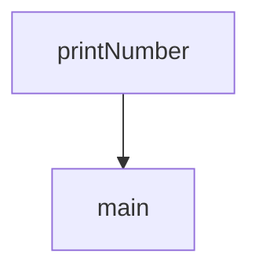

함수 호출 시 생성되며 함수의 `지역변수`, `파라미터`와 `리턴 주소` 등을 담고 있다. 스택에 저장되므로 `스택 프레임(Stack Frame)`이라고도 한다. 함수가 종료되면 스택에서 제거된다.

## 구성 요소


### Return Value

- `호출자(Caller)`에게 값을 반환하기 위해 사용

### Actual Parameters

- 호출된 함수에게 전달하는 매개변수

### Control Link

- 스택의 `이전 레코드`를 가리킴
	- 이는 호출자의 활성 레코드임
- Dynamic하게 동작하는 프로그램은 Control Link들의 체인으로 추적된다.
- 그래서 이를 `Dynamic Link`라고도 함



예를 들어 `main()`에서 `printNumber()`를 호출하면 다음과 같은 컨트롤 링크가 생성된다. `printNumber()`가 자신의 호출한 `main()`의 레코드를 주소를 가지고 있는 모습이다.

### Access Link

- `다른 활성화 레코드`에 저장된 비로컬 데이터를 참조하는 데 사용
	- 다시 말해 전역 변수에 접근하기 위한 것
- `Static Link`라고도 함

```C
int num = 10;

void printNumber() {
	printf("%d", num);
}

void main() {
	printNumber(); // 10 출력
}
```

예시 코드에서 `main()`을 실행하면 `10`이 출력된다. 이것이 가능한 이유는 `printNumber()`가 전역변수인 `num`에 액세스할 수 있기 때문이다. 이것을 가능케 하는 것이 Activation Record의 `Access Link`이다. `printNumber()`의 Access Link는 전역변수인 num을 참조하고 있으므로 지역변수가 아님에도 사용할 수 있다.

### Saved Machine Status

- 함수 호출 전의 `기계 상태`를 저장
	- `Program Counter(PC)` 값
	- 복원해야 하는 `레지스터 값`들

### Local Data

- 로컬 데이터를 저장

### Temporaries

- 표현식(Expression) 평가에서 발생하는 값을 저장

## 스택 포인터와 Activation Record

1. `Stack Pointer(SP)`는 초기에 `스택의 상단`을 가리킨다.
2. 함수 호출 시 Activation Record를 할당하기 위해서 `SP를 감소`
3. 함수 종료 시 스택에서 Activation Record를 해제하기 위해 `SP를 증가`

## 출처
- [JavaTPoint - Activation Record](https://www.javatpoint.com/activation-record)
- [GeeksForGeeks - Activation Records](https://www.geeksforgeeks.org/access-links-and-control-links/amp/)