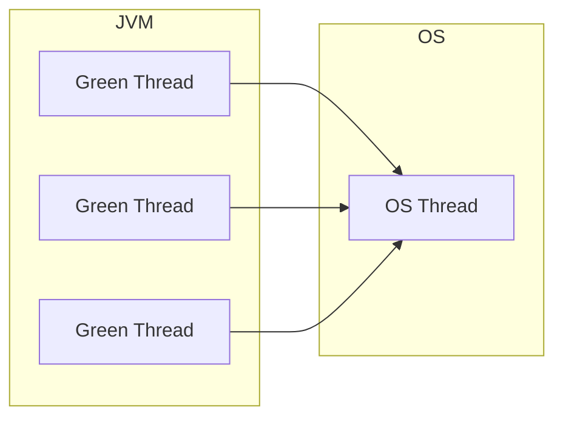
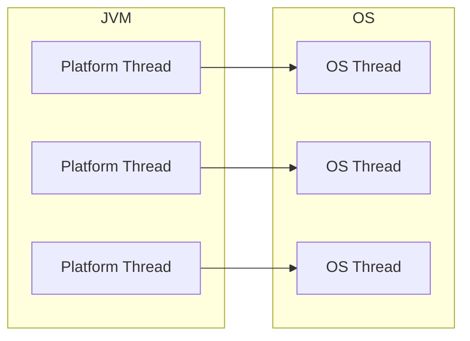
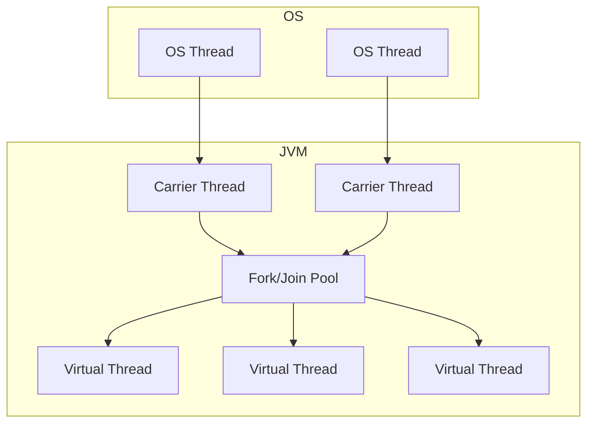

[[JVM]]에서 [[스레드]]는 버전에 따라 다양한 모델로 구현되어 왔다.

Green Thread
---

`Green Thread`는 [[스레드#사용자 수준 스레드(User Level Thread)|사용자 수준 스레드]]로, 운영체제의 스레드를 JVM 내에서 여러 스레드로 분리하여 관리한다. 스케줄링 또한 JVM에서 처리한다. 하지만 성능 상의 문제로 Java 1.3 이후로는 사용되지 않는다.

- 장점
	- 낮은 스레드 관리 비용
	- 빠른 `컨텍스트 스위칭(Context Switching)`
- 단점
	- 멀티 코어 지원 X
	- 각 스레드가 처리할 수 있는 성능 제한

Platform Thread
---

`Platform Thread`는 [[스레드#커널 수준 스레드(Kernel Level Thread)|커널 수준 스레드]]를 그대로 사용하기 위해 1:1로 매핑한 것이다. 따라서 사용자는 JVM의 Platform Thread를 통해 운영체제의 스레드를 이용하지만, 스케줄링은 OS에서 이루어진다.

- 장점
	- 멀티 코어 지원
	- 커널 수준 스레드와 동일한 수준의 성능
- 단점
	- 높은 스레드 관리 비용
		- 커널 수준의 스레드를 생성하는 것은 많은 비용을 야기함
	- 느린 `컨텍스트 스위칭(Context Switching)

Virtual Thread
---

`Virtual Thread`는 Java 21부터 공식적으로 지원되는 새로운 경량스레드로, Green Thread와 Platform Thread의 특징을 합친 [[스레드#혼합형 스레드(Combined Thread)|혼합형 스레드]]이다. `Fork/Join Pool`이라는 것을 사용하여 실제 운영체제 스레드를 가상의 스레드로 재분배하는 방식이다.

- 장점
    - Green Thread와 Platform Thread의 장점을 모두 가짐
    - 기존 동기 방식으로 작성된 코드에서도 높은 성능을 얻을 수 있음
    - 더 이상 스레드 풀(Thread Pool)을 사용하지 않아도 됨
- 단점
    - 아직 초창기 단계로, 기존 코드와 100% 호환되지 않을 수 있음
