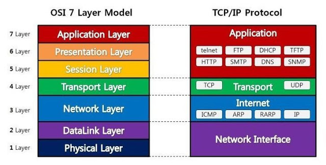

기본 요소
---

- 구문(Syntax)
  - 전송하고자 하는 데이터의 형식, 부호화, 신호 레벨등을 규정
- 의미(Semantics)
  - 두 기기 간의 효율적이고 정확한 정보 전송을 위한 협조 사항과 오류 관리를 위한 제어 정보를 규정
- 시간(Timing)
  - 두 기기 간의 통신 속도, 메시지의 순서 제어 등을 규정

기능
---

### 주소 설정

한 개체가 상태 개체에 데이터를 전송하려면 상대의 이름을 알아야 하는데, 프로토콜에는 각 전송 계층에 맞는 주소를 지정하는 기능이 있다.

### 순서 제어

프로토콜 데이터 단위가 전송될 때 보내지는 순서를 명시하는 기능으로, 연결 지향성에만 사용한다.

> 프로토콜 데이터 단위(PDU, Protocol Data Unit): 데이터 전송 시, 일정 크기의 데이터 블록

순서를 지정하는 이유는 전달, 흐름 제어, 오류 제어 등을 위해서이다. PDU를 상대 개체에 보내면 수신측에서 순서에 맍게 데이터를 재구성한다. 이때 잘못된 PDU는 재전송을 요구한다.

###  단편화 및 재조합

대용량 파일의 경우 한 번에 전달하는 것이 불가능하므로 전송 효율이 높은 작은 단위로 나누어 전송한다. 이를 수신하는 시스템에서는 응용 프로그램에서 사용하기 위해 재조합해야 한다. 

### 캡슐화

데이터에 제어 정보를 덧붙이는 것으로 SDU에 PCI를 더하는 과정이라 할 수 있다.

```
PDU(Protocol Data Unit) = SDU(Service Data Unit) + PCI(Protocol Control Information)

# SDU: 전송하려는 데이터
# PCI: 제어 정보(주소, 오류검출코드, 프로토콜 제어 정보 등)
```

이러한 캡슐화는 해커로부터 통신 내용을 숨길 수 있게 한다.

### 연결 제어

데이터를 교환할 때 연결 설정 여부에 따라 두 가지로 나뉨

- 연결 지향형 데이터 전송
  - 연결 설정 -> 데이터 전송 -> 연결 해제
  - 데이터 전송 중 연결 지속
  - 대표적 예시: TCP
- 비연결 지향형 데이터 전송
  - 이렇게 전송되는 데이터 = 데이터그램
  - 대표적 예시: UDP

### 흐름 제어

송신측에서 오는 데이터의 양이나 속도를 조절하는 기능으로 정보 유실을 방지한다.

- 정지-대기(stop and wait)
  - 패킷 하나를 보낸 후 응답이 오면 다음 패킷 전송
- 슬라이딩 윈도우(sliding window)
  - 가용 데이터 분량의 패킷을 한번에 보낸 뒤 응답받음
  - 이후 동일한 양의 패킷을 한번에 전송

### 오류 제어

데이터를 교환할 때 SDU나 PCI가 잘못되었을 경우, 이를 발견하는 기법

- 패리티 비트(parity bit)
- 순환 잉여도 검사(CRC, Cyclic Redundancy Check)

순서를 검사하거나 특정 시간 안에 받지 못하면 재전송을 요구하는 방식

### 동기화

데이터를 전송할 때 각 개체는 특정 타이머 값이나 윈도우 크기 등을 기억해야 하는데, 이것들을 공유하는 것을 동기화라 한다.

### 다중화

통신 선로 하나에서 여러 시스템이 동시에 통신할 수 있는 기법

### 전송 서비스

우선순위 결정, 서비스 등급과 보안 요구 등을 제어하는 서비스

종류
---

프로토콜의 종류를 설명하기 위해서 OSI 7계층과 함께 살펴보도록 하겠다.



### 데이터 링크 계층

OSI 7계층에서 물리 계층 위에 있는 2번째 계층이다. 하드웨어에 대한 MAC(Media Access Control) 주소를 기반으로 하드웨어 간 통신을 위한 프로토콜을 제공한다.

#### 이더넷 프로토콜

- 제록스의 PARC에서 1970년대에 개발
- 패킷 최소 길이: 64KB, 최대 길이: 1,518KB
- 1980년대 IEEE 802.3이 규약의 기초
- 현재는 CSMA/CD LAN을 이르는 말로 사용됨

### 네트워크 계층

OSI 7계층의 3계층으로, 논리적인 주소인 IP주소를 이용해 통신하기 위한 프로토콜을 제공한다.

#### ARP(Address Resolution Protocol)

- 네트워크 계층에서의 통신을 위해서는 하위 계층인 데이터 링크 간의 통신 경로가 확보되어야 함.
  - IP간 통신을 위해서는 MAC 주소를 확보가 우선
- ARP은 IP를 보조하기 위한 프로토콜
  - MAC 주소를 사용해 통신을 하지만 정보로 담기는 값 = IP
  - 데이터 링크 계층과 네트워크 계층 중간에 위치한다고 볼 수 있음
- RARP는 ARP의 반대 역할
  - MAC 주소를 가지고 IP를 확인하는 프로토콜

#### IP(Internet Protocol)

- 하위 계층의 서비스를 이용하여 두 노드 간의 데이터 전송 경로를 확립
  - 데이터 링크 계층은 같은 회선(LAN 구간) 간 통신
  - 네트워크 계층은 회선이 서로 다른 노드 사이(WAN 구간) 통신
- IP(v4)는 32자리 2진수로 개수 제한
  - 체계적 사용을 위한 규칙이 있음
  - A~E클래스로 구분
    - A 클래스: 첫 자리 네트워크 주소, 나머지 호스트 주소
    - B 클래스: 두 자리 네트워크 주소, 나머지 호스트 주소
   - C 클래스: 세 자리 네트워크 주소, 나머지 호스트 주소

#### ICMP(Internet Control Message Protocol)

- 호스트 서버와 인터넷 게이트웨이 사이에서 메시지 제어, 오류 검출
- 비연결 지향형 프로토콜인 IP를 보조하여 패킷 전송을 보장한다.
- ping이 대표적인 예

#### IGMP(Internet Group Management Protocol)

멀티 캐스트에 관여하는 프로토콜로 멀티캐스트 그룹을 관리

```
IP 통신 방식
- 유니캐스트
  - 한 호스트에서 다른 호스트로 전송한 것
  - 일반적인 IP 데이터 전송은 모두 이것을 사용
- 브로드캐스트
  - 호스트에서 IP 네트워크 상 전체 호스트로 데이터 전송
  - 일반적인 브로트캐스트는 `255.255.255.255`
- 멀티캐스트*
  - 그룹에 속한 모든 호스트에게 전달
  - D 클래스 주소 대역을 사용
```

### 전송 계층 프로토콜

응용 프로그램 주소를 포트 번호로 이용해 통신하는 프로토콜을 제공

#### TCP(Transmission Control Protocol)

전송 계층에서 동작하는 연결 지향형 프로토콜

- 특징
  - 높은 신뢰성
  - 연결의 설정과 해제
  - 시간 초과와 재전송
  - 가상 회선 연결 방식
  - 데이터 체크섬
  - 데이터 흐름 제어

연결을 설정하는 과정을 3-way handshacking이라 한다.

**연결 생성 과정**


1. 클라이언트는 포트가 Closed 상태이고 서버는 Listen 상태
2. 클라이언트는 임의의 포트 번호를 열고 서버에 SYN을 보냄
3. 서버는 클라이언트의 요청을 받고 SYN + ACK 패킷을 보냄
4. 클라이언트가 연결 요청에 대한 서버 응답을 확인했음을 ACK 패킷을 보냄

**연결 해제 과정**


1. 통신 중인 상태(Established)
2. 클라이언트가 서버에 FIN 패킷을 보내서 통신을 끊고자 함을 전달
3. 서버는 연결 종료 요청을 확인하고 ACK 패킷으로 응답, 연결을 종료한다는 의미에서 FIN 패킷을 보냄
4. 클라이언트는 연결 종료 요청에 대한 서버의 응답을 확인했다는 의미로 ACK 패킷을 서버에 보냄

#### UDP(User Datagram Protocol)

비연결 지향형 프로토콜로 상대방이 보낸 응답에 확인하지 않는다.

- 특징
  - 데이터의 목적지 확인 절차를 생략하므로 네트워크 부하가 적음
  - 데이터의 비신뢰성
  - 수신한 데이터 무결성 보장 X

### 응용 계층

우리가 사용하는 응용 프로그램이 네트워크와 통신하기 위해 사용하는 프로토콜

#### FTP(File Transfer Protocol)

파일 전송을 위한 가장 기본 프로토콜

- 연결 방식
  - 컨트롤 연결
    - 21번 포트를 열고 클라이언트 요청 대기(수동적 포트 오픈)
    - 클라이언트에서 포트를 설정하고 FTP 요청(능동적 포트 오픈)
  - 데이터 연결
    - 클라이언트에서 임의의 포트 오픈 (수동적 포트 오픈)
    - 클라이언트에서 PORT 명령어로 포트 번호를 서버에게 전송
    - 서버에서 20번 포트를 오픈 (수동적 포트 오픈)

#### Telnet

사용자가 원격에 있는 서버에 로그인하도록 TCP 연결을 설정하며, 단말기가 원격 컴퓨터 바로 옆에 있는 것처럼 직접 조작할 수 있도록 한다.

- 기능
  - 네트워크 가상 단말기 기능
  - 클라이언트-서버 간 통신 옵션 교환 메커니즘
  - 양단 통신 대칭적 수행
