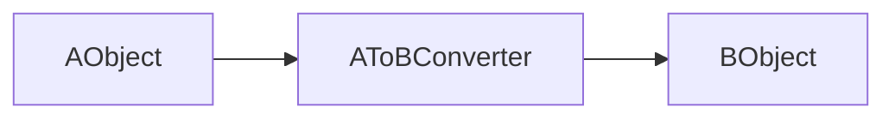

Spring Core에서 제공하는 [Type Conversion](https://docs.spring.io/spring-framework/reference/core/validation/convert.html) 기능이다. 



쉽게 말해 A 타입의 데이터를 B 타입으로 변경하고 싶을 때 사용한다.

# Converter 등록하기

컨버터는 라이브러리 단에서 제공하는 경우도 있지만 사용자가 직접 정의할 수도 있다.
## Converter SPI

일반적인 컨버터는 `Converter` 인터페이스를 이용해서 만들 수 있다.

```java
package org.springframework.core.convert.converter;

public interface Converter<S, T> {

	T convert(S source);
}
```

String을 Integer로 변환하는 컨버터를 만들고 싶다면 다음과 같이 만들 수 있다.

```java
package org.springframework.core.convert.support;

final class StringToInteger implements Converter<String, Integer> {

	public Integer convert(String source) {
		return Integer.valueOf(source);
	}
}
```
## ConverterFactory

하지만 때에 따라 다형성이 지원되는 컨버터가 필요할 수 있다. 이러한 경우 `ConverterFactory`를 사용할 수 있다.

```java
package org.springframework.core.convert.converter;

public interface ConverterFactory<S, R> {

	<T extends R> Converter<S, T> getConverter(Class<T> targetType);
}
```

예를 들어 Enum 타입에 대한 String 컨버터를 정의하고 싶다면 다음과 같이 할 수 있다.

```java
package org.springframework.core.convert.support;

final class StringToEnumConverterFactory implements ConverterFactory<String, Enum> {

	public <T extends Enum> Converter<String, T> getConverter(Class<T> targetType) {
		return new StringToEnumConverter(targetType);
	}

	private final class StringToEnumConverter<T extends Enum> implements Converter<String, T> {

		private Class<T> enumType;

		public StringToEnumConverter(Class<T> enumType) {
			this.enumType = enumType;
		}

		public T convert(String source) {
			return (T) Enum.valueOf(this.enumType, source.trim());
		}
	}
}
```
