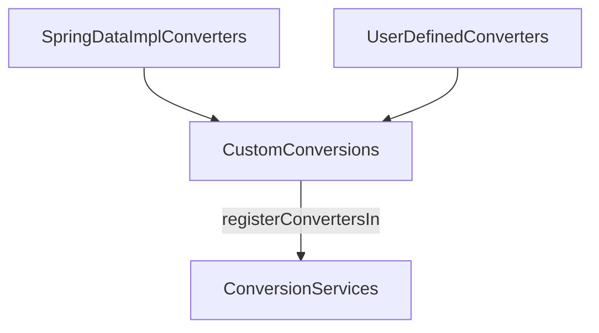

---
tags:
  - spring-data
---
## Api

[org.springframework.data.convert.CustomConversions](https://docs.spring.io/spring-data/commons/docs/current/api/org/springframework/data/convert/CustomConversions.html)

```java
Class CustomConversions
```

- Spring Data 구현체에서 제공한 [[Converter]] 등록을 위한 `VO(Value Object)`이다.

## 주요 메서드

- [isSimpleType](https://docs.spring.io/spring-data/commons/docs/current/api/org/springframework/data/convert/CustomConversions.html#isSimpleType(java.lang.Class))
	- 단순한 타입인지 확인하기 위한 메서드
	- 일반적인 타입이거나 컨버터가 등록된 타입인 지를 확인
- [registerConvertersIn](https://docs.spring.io/spring-data/commons/docs/current/api/org/springframework/data/convert/CustomConversions.html#registerConvertersIn(org.springframework.core.convert.converter.ConverterRegistry))
	- 컨버터를 [[ConversionService]]에 등록하는 메서드
## 컨버터 등록 과정

`CustomConversions`는 아래와 같은 두 가지 종류의 컨버터를 가지고 있다.

- Spring Data 구현체 제공
- 사용자 커스텀 등록



이러한 컨버터들은 [registerConvertersIn()](https://docs.spring.io/spring-data/commons/docs/current/api/org/springframework/data/convert/CustomConversions.html#registerConvertersIn(org.springframework.core.convert.converter.ConverterRegistry)) 메서드가 호출되는 시점에 [[ConversionService]]에 등록된다.
