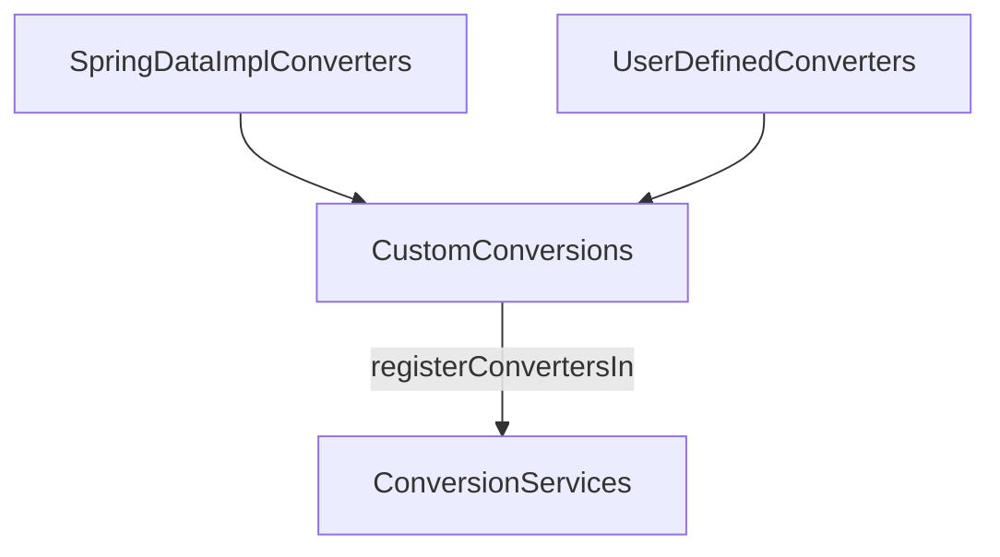

---
tags:
  - spring-data
---

[org.springframework.data.convert.CustomConversions](https://docs.spring.io/spring-data/commons/docs/current/api/org/springframework/data/convert/CustomConversions.html)

```java
Class CustomConversions
```


- Spring Data 구현체에서 제공한 [[Converter]] 등록을 위한 `VO(Value Object)`이다.
- 두 가지 종류의 Converter 리스트를 가지고 있다.
	- Spring Data 구현체 제공
	- 사용자가 커스텀하여 등록
- [registerConvertersIn()](https://docs.spring.io/spring-data/commons/docs/current/api/org/springframework/data/convert/CustomConversions.html#registerConvertersIn(org.springframework.core.convert.converter.ConverterRegistry)) 메서드를 통해 모든 컨버터들은 [[ConversionService]]에 등록된다.

## 다이어그램

모든 과정을 다이어그램으로 표현하면 다음과 같다.


