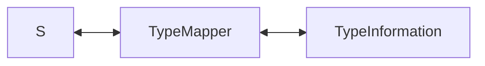

---
tags:
  - spring-data
---

도메인 객체가 JSON과 같은 데이터로 변경되면 기존 타입 정보(Type Information)는 유실된다.
이러한 정보를 유지하기 위해서는 `_class`와 같은 필드를 추가적으로 만들어 저장해야 한다.
`TypeMapper`는 도메인 객체와 데이터 객체 변경 간에 필요한 타입 정보 매핑을 수행한다.
