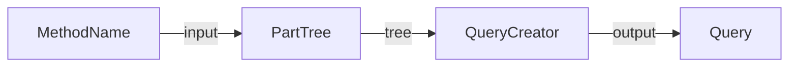

Spring Data의 `Repository` 인터페이스는 메서드명을 사용하여 동적 쿼리를 생성하는 기능을 제공한다.
## 동작 과정

사용자가 정의한 메서드명이 쿼리로 변환되는 과정을 아주 간단하게 살펴보면 다음과 같다.

1. 메서드 이름은 [PartTree](https://docs.spring.io/spring-data/commons/docs/current/api/org/springframework/data/repository/query/parser/PartTree.html)에게 전달된다.
2. `PartTree`는 메서드 이름에서 Tree를 파싱해낸다.
3. [QueryCreator](https://docs.spring.io/spring-data/commons/docs/current/api/org/springframework/data/repository/query/parser/AbstractQueryCreator.html)는 Tree를 기반으로 `Query`를 만들어낸다.
## 관련 클래스

### PartTree

[PartTree](https://docs.spring.io/spring-data/commons/docs/current/api/org/springframework/data/repository/query/parser/PartTree.html)는 메서드명을 파싱하는 클래스이자 `QueryCreator`에게 전달되는 VO로써 사용된다.
#### OrPart

- [Orpart](https://docs.spring.io/spring-data/commons/docs/current/api/org/springframework/data/repository/query/parser/PartTree.OrPart.html)는 메서드명을 `Or` 키워드로 분리한 단위이다.
	- `PartTree`의 노드 타입
#### Part

- 메서드명을 파싱하는 최소 단위
	- `OrPart`은 `Part`의 집합이다.
### QueryCreator

- PartTree를 사용하여 쿼리를 생성한다.
- [AbstractQueryCreator]((https://docs.spring.io/spring-data/commons/docs/current/api/org/springframework/data/repository/query/parser/AbstractQueryCreator.html)를 사용하여 구현된다.
- 두 개의 제네릭 파라미터를 받는다.
	- T - 생성할 쿼리(Query) 타입
	- S - 중간 표현(Criteria) 타입
#### Query

- 결과적으로 메서드를 파싱해서 만들고자 하는 쿼리이다.
- 해당 부분은 Spring Data 구현체 별로 달라질 수 있다.
- 예를 들어 JPA의 경우 Query로 JPQL을 사용한다.

#### Criteria

- Query를 만들기 위한 `중간 표현`이다.
- PartTree를 Traverse해서 Criteria를 생성하고 합친다.
	- 따라서 Criteria 클래스는 체이닝 가능한 형태로 구현되어야 한다.
