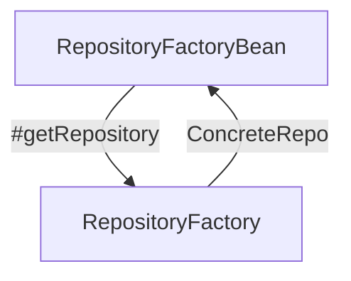

> ⚠️ Spring Data 라이브러리를 직접 구현하며 얻은 지식들을 정리한 문서이므로, 내용 상에 오류가 있을 수도 있습니다.

**Spring Data**를 사용하면 인터페이스만 정의하는 것으로 `Repository`를 사용할 수 있다. 해당 문서에서는 어떻게`Repository`가 빈으로 생성되는 지에 대해 다룬다.
## RepositoryFactory

`RepositoryFactory`는 Repository를 생성하는 팩토리 클래스이다. [getRepository](https://docs.spring.io/spring-data/commons/docs/current/api/org/springframework/data/repository/core/support/RepositoryFactorySupport.html#getRepository(java.lang.Class)) 메서드에 Repository 인터페이스를 전달하면 Repository 구현을 반환한다. 해당 클래스의 구현은 추상 클래스인[RepositoryFactorySupport](https://docs.spring.io/spring-data/commons/docs/current/api/org/springframework/data/repository/core/support/RepositoryFactorySupport.html#getRepository(java.lang.Class))를 사용한다.



하지만 일반적으로 RepositoryFactory를 **직접 사용하지는 않는다**. `RepsitoryFactoryBean`가 대신 RepositoryFactory를 호출하여 필요한 Repository 객체를 생성하고 빈에 등록해주기 때문이다.
## RepositoryFactoryBean

```java
interface UserRepository extends CrudRepository<User, Integer> {}
```

예를 들어 `UserRepository`를 위와 같이 만든다고 가정해보자.


그러면 `RepositoryFactoryBean`을 통해 실제 객체(Proxy 객체)로 만들어 빈으로 등록한다. 해당 클래스의 구현은 추상 클래스인 [RepositoryFactoryBeanSupport](https://docs.spring.io/spring-data/commons/docs/current/api/org/springframework/data/repository/core/support/RepositoryFactoryBeanSupport.html)를 사용한다.

> 일반적인 데이터스토어는 RepositoryFactory와 RepositoryFactoryBean 모두 직접 구현해야 한다.

> 반면 Spring Data KeyValue를 사용한 구현체의 경우 기본 구현이 제공된다.
> - [KeyValueRepositoryFactory](https://docs.spring.io/spring-data/keyvalue/docs/current/api/org/springframework/data/keyvalue/repository/support/KeyValueRepositoryFactory.html)
> - [KeyValueRepositoryFactoryBean](https://docs.spring.io/spring-data/keyvalue/docs/current/api/org/springframework/data/keyvalue/repository/support/KeyValueRepositoryFactoryBean.html)

## 프록시 객체


- 일반적으로 Repository에 대한 기본 구현은 `SimpleXXXRepository`에 되어 있다.
	- e.g. [SimpleElasticsearchRepository](https://docs.spring.io/spring-data/elasticsearch/docs/current/api/org/springframework/data/elasticsearch/repository/support/SimpleElasticsearchRepository.html), [SimpleKeyValueRepository](https://docs.spring.io/spring-data/keyvalue/docs/current/api/org/springframework/data/keyvalue/repository/support/SimpleKeyValueRepository.html)
- [[Query Methods]]로 정의한 로직은 동적 생성되어 프록시 객체에 담긴다.
- 따라서 생성되는 프록시 객체는 `기본 구현 + 사용자 정의 로직`을 수행할 수 있다.
