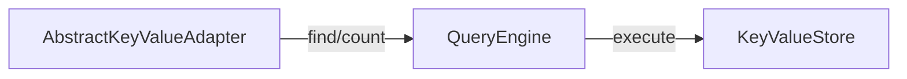

---
tags:
  - spring-data
  - spring-repository
  - query-methods
---
> ⚠️ Spring Data 라이브러리를 직접 구현하며 얻은 지식들을 정리한 문서이므로, 내용 상에 오류가 있을 수도 있습니다.

## 실행 과정

1. 사용자 정의 메서드가 호출된다.
2. `QueryExecutorMethodInterceptor#invoke` 호출된다.
3. 메서드와 대응되는 `RepositoryQuery`가 있는 지 확인한다.
	- [[Query Methods#RepositoryQuery 생성]]에서 만들어둔 queries를 활용
4. `RepositoryMethodInvoker#forRepositoryQuery`를 호출한다.
	- 세부적으론 아래 메서드들도 호출됨.
		- `RepositoryQuerMethodInvoker#forRepositoryQuery`
		- `new RepositoryMethodInvoker`
5. 결과적으로 `RepositoryQuery#execute`가 실행된다.
6. `Template`에 선언된 메서드로 전달된다.
	- 따라서 Query를 처리하기 위한 메서드가 정의되어 있어야 함.

## Template

Spring Data 구현체들은 모든 로직 처리를 Template이라는 클래스에서 처리한다. 다만 Spring Data KeyValue를 사용하여 구현한 경우(Spring Data Redis)는 Template과는 구분되는 [Adapter](https://docs.spring.io/spring-data/keyvalue/docs/current/reference/html/#key-value.core-concepts)이라는 레이어를 가지고 있다.
## Query Engine

Spring Data KeyValue에서는 [QueryEngine](https://docs.spring.io/spring-data/keyvalue/docs/current/api/org/springframework/data/keyvalue/core/QueryEngine.html)이라는 쿼리를 수행하는 엔진을 제공한다. 

1. `KeyValueAdapter`가 QueryEngine에게 **Query와 함께 요청**한다.
2. `QueryEngine`의 내부 로직을 통해 실제 **Key-Value 스토어**에 오퍼레이션을 수행한다.
3. 응답에 따라 값을 리턴한다.
