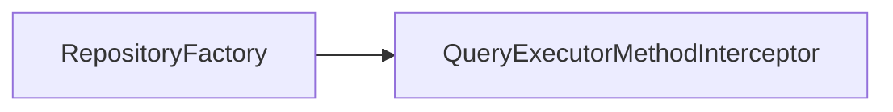
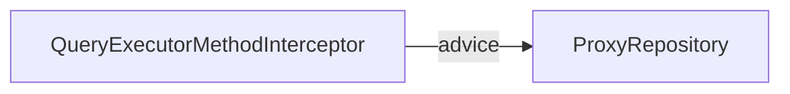
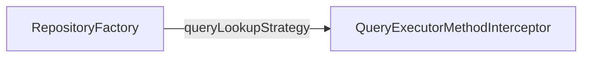

---
tags:
  - spring-data
  - spring-repository
  - query-methods
---

> ⚠️ Spring Data 라이브러리를 직접 구현하며 얻은 지식들을 정리한 문서이므로, 내용 상에 오류가 있을 수도 있습니다.

[Query Methods](https://docs.spring.io/spring-data/commons/docs/current/api/org/springframework/data/repository/query/QueryMethod.html)는 메서드명으로 원하는 동작을 정의하는 Spring Data의 핵심 기능 중 하나이다. 이것이 가능한 이유에 대해서는 [[Repository]] 문서에서 아주 간단히 살펴보았다. 이번 문서에는 구체적으로 어떤 원리에 의해서 동적으로 Query 생성이 가능한 지에 대해서 알아본다.
## QueryExecutorMethodInterceptor

`QueryExecutorMethodInterceptor`는 [MethodInterceptor](https://docs.spring.io/spring-framework/docs/current/javadoc-api/org/aopalliance/intercept/MethodInterceptor.html)를 구현한 클래스이다. Repository 인터페이스에 정의된 Query Method들을 동적으로 생성하여 Proxy 객체에 주입하기 위해 사용한다. 

MethodInterceptor는 Spring AOP의 Advice 인터페이스이며 CGLIB을 위해서 사용한다. 따라서 Proxy로 생성되는 Repository는 CGLIB을 이용한다는 사실을 알 수 있다.
### RepositoryQuery 생성

QueryExecutorMethodInterceptor의 생성은 [RepositoryFactorySupport#getRepository](https://docs.spring.io/spring-data/commons/docs/current/api/org/springframework/data/repository/core/support/RepositoryFactorySupport.html#getRepository(java.lang.Class))이 호출되는 시점에 이루어진다. 이때, 생성자에서는 Repository에 정의된 Query Method들을 각자 하나의 RepositoryQuery 객체로 변환하고 `Map<Method, RepositoryQuery> queries` 필드에 저장한다.
### Proxy Repository에게 제공

이후, ProxyRepository를 생성하는 데 필요한 Advice 객체로써 제공된다.
## RepositoryQuery

`RepositoryQuery`은 PartTree와 QueryCreator를 사용하여 [[Query Creation]]을 수행한다. 또한 내부적으로 execute라는 메서드를 가지고 있어 Query 실행에도 사용된다.
## QueryLookupStrategy

[QueryLookupStrategy](https://docs.spring.io/spring-data/commons/docs/current/api/org/springframework/data/repository/query/QueryLookupStrategy.html)는 RepositoryQuery를 조회하는 방법에 대한 전략을 설정하기 위한 인터페이스다.

`RepositoryFactory`가 `QueryExecutorMethodInterceptor`를 생성하는 시점을 좀 더 자세히 살펴보면queryLookupStrategy를 전달하는 부분이 있다.
### resolveQuery

[resolveQuery](https://docs.spring.io/spring-data/commons/docs/current/api/org/springframework/data/repository/query/QueryLookupStrategy.html#resolveQuery(java.lang.reflect.Method,org.springframework.data.repository.core.RepositoryMetadata,org.springframework.data.projection.ProjectionFactory,org.springframework.data.repository.core.NamedQueries))는 QueryExecutorMethodInterceptor가 RepositoryQuery를 직접적으로 생성하는 메서드이다. 따라서 RepositoryQuery를 조회하는 방법에 대한 전략을 설정할 수 있게 된다.

## 그러면 실행은?

앞선 과정을 통해 결과적으로 `QueryExecutorMethodInterceptor`에는 `queries`라는 필드에 `Map<Method, RepositoryQuery>`를 저장하고 있다. 따라서 QueryExecutorMethodInterceptor의 invoke 메서드를 통해 Method에 해당하는 Query를 가져와 실행할 수 있게 된다.

더 자세한 실행 과정은 [[Query Execution]]에서 다뤄보도록 한다.